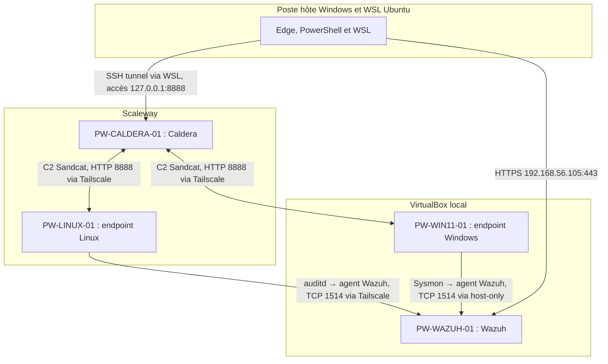

# PurpleWatch — schéma du laboratoire hybride

**Référence :** source de vérité PurpleWatch, état documenté au 24 septembre 2026. Les adresses et services sont à vérifier avant chaque démonstration. Les flèches indiquent le sens logique des connexions ; le trafic de retour circule sur les mêmes sessions.

| Zone | Machine | Rôle | Accès de référence |
| --- | --- | --- | --- |
| Cloud Scaleway | PW-CALDERA-01 | Serveur Caldera, orchestration, C2 Sandcat | Tailscale `100.103.199.63`, HTTP 8888 |
| Cloud Scaleway | PW-LINUX-01 | Endpoint Sandcat, auditd, agent Wazuh | Tailscale `100.127.134.63` |
| VirtualBox local | PW-WAZUH-01 | Manager, Indexer, Dashboard Wazuh | Host-only `192.168.56.105`, HTTPS 443, agent TCP 1514 |
| VirtualBox local | PW-WIN11-01 | Endpoint Sandcat, Sysmon, agent Wazuh | Host-only `192.168.56.106`, Tailscale `100.115.23.127` |
| Poste hôte | Windows et WSL Ubuntu | Navigateur, SSH, tunnel Caldera | `127.0.0.1:8888` via tunnel WSL |

## Données transportées

1. Caldera envoie à Sandcat une commande contrôlée, puis reçoit son statut et sa sortie. Les commandes du pilote T1016 restent dans le laboratoire autorisé.
2. Linux produit des enregistrements auditd `execve`, lus depuis `/var/log/audit/audit.log` par l'agent Wazuh et transmis au manager.
3. Windows produit des événements Sysmon, collectés par l'agent Wazuh local puis transmis au manager.
4. Le manager évalue les règles PurpleWatch ; le dashboard présente les alertes et la matrice relie leur identifiant aux opérations Caldera.
5. Le journal normalisé conserve les identifiants et les heures UTC des deux systèmes, sans secrets ni sorties contenant des données sensibles.

**Ressources de démonstration :** poste hôte d'environ 8 Go de RAM. Privilégier des phases Windows et Wazuh séquentielles ; une courte simultanéité est nécessaire pour un retest Windows avec alerte fraîche. Linux cloud et Wazuh local peuvent être actifs ensemble. Le tunnel WSL est une voie de pilotage, distincte du C2 Sandcat par Tailscale.
